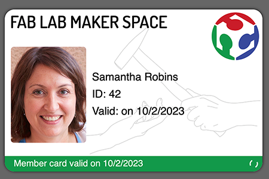

# Ausweis

A Django app for digital membership cards.




## Features

- Encrypted personal data
- Cards with limited validity and auto-expire
- Daily validity and animation to prohibit screenshots
- Access your cards as bookmark or Homescreen app
- Fully customizable card design (html,css,js knowledge required)
- Extensible custom fields
- Static frontend with separate backend for card management (can be used offline)


## Install (Docker)

### 1. Clone this repo or download the code to your server.

Alternatively you can rsync the content to your server:

```sh
make push SSH=user@domain:/path/to/ausweis
```

(this will rsync: `backend/*`, `Makefile`, `docker-compose.yml`)


### 2. Create your environment file

You must generate a secure key first. Alternatively, you can run `make gen-key` to generate a new key but this will only work if the container is already running (next step). To apply the new key, you must reboot the container (`make stop start`).

File: `/path/to/ausweis/.env`

```sh
DJANGO_SECRET_KEY='your-fancy-secret'
ALLOWED_HOSTS=mydomain
#URL_SUBPATH=backend
DEBUG=0
```


Then set the permissions of the file to be readable only by the docker user:

```sh
chown root:root "/path/to/ausweis/.env"
chmod 600 "/path/to/ausweis/.env"
```


### 3. Start the container

```sh
make start
make init  # only needed the first time (creates admin user)
```


### 4. Configure webserver

You can run this server either on same url or split the backend and frontend part into two. Refer to the `nginx.conf` files in `frontend`.

Make sure to configure the file properly. See [frontend/README.md](frontend/README.md) for further instructions.

You may need to create an SSL certificat first (e.g., Certbot).


### 5. Test your server

Open the administration page to create new cards. Depending on your configuration this URL will be hosted at `https://your-domain.com/<subpath>/edit/`.


## Install (vanilla)

**Not tested** but should be similar to the Docker setup. You will need to install `pip install gunicorn uvicorn` and run the Django application directly (see `scripts/on_deploy.sh`). Further, you will need to update `STATIC_ROOT` and `EXPORT_PATH` in your `settings.py`. (And probably check how to pass the env-file to `gunicorn`). Finally, you should persist the service to respawn after a system reboot.


## Next steps

So your server is running and you have created your first card. What's next?

- Modify the frontend html example to match the design of your business / workshop (see [Frontend](#frontend) below).

- If you need more fields, use the "Additional data" json (e.g., `{"extra":"Value"}`). And in your html: `<i id="extra">placeholder</i>`.

- You probably want to modify the webmanifest so that you can "install" your member card as an "app" (incl. `apple-touch-icon` etc.). Have a look at the [real favicon generator](https://realfavicongenerator.net/) or create your own.


## Develop

### Frontend

1. Start a webserver from `./frontend/example-html/`.
A simple static server is sufficient (e.g., `python -m SimpleHTTPServer 80` or `php -S 0:80`)

2. Open http://127.0.0.1/#org/d9498400-2640-442e-a092-6b4537a9b74d/rpsLvt6armrp


### Backend

1. Prepare virtual environment and start dev server:

```sh
cd backend
python3 -m venv .venv
. ./.venv/bin/activate
pip install -r requirements.txt
./manage.py runserver
```

2. Open http://127.0.0.1:8000/edit/
3. Create a member and an organization (with URL `http://127.0.0.1`)
4. Create a symlink for the data folder to use your backend json files directly:

```sh
cd frontend/example-html
ln -s ../../backend/data/export data
# alternative: edit `EXPORT_PATH` in `backend/config/settings.py`
```
